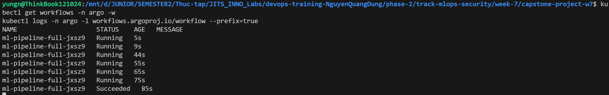
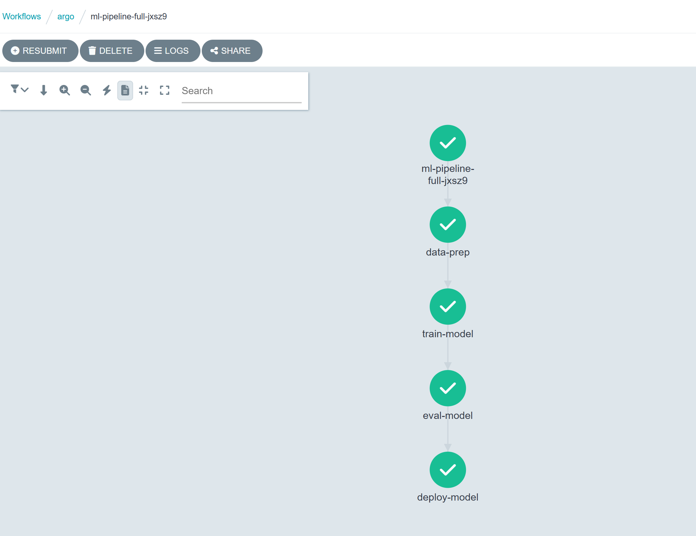
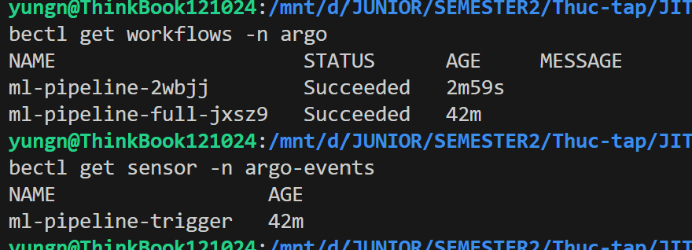

# Task Submission Template

## Task: `Week 7 - Capstone: Argo Workflows + Cloud Security End-to-End`

- **Intern**: `Nguyễn Quang Dũng`
- **Phase / Week / Day**: `Phase 2 / Week 7 / Capstone`
- **Branch**: `phase-2/week-7`
- **Submitted at**: `2026-08-03` (timezone +07)
- **Time spent**: `8h`

## 1. Mục tiêu
Xây dựng một hệ thống tích hợp end-to-end kết hợp toàn bộ kiến thức của Week 7, bao gồm hai phần chính:
- **MLOps**: Xây dựng Pipeline huấn luyện ML tự động hoàn chỉnh sử dụng Argo Workflows và Argo Events, bao gồm các step Data Prep → Train → Eval → Deploy. Pipeline tự động kích hoạt khi có thay đổi dữ liệu từ DVC.
- **Security**: Thiết lập lớp bảo vệ Cloud Security toàn diện trên Google Cloud bao gồm Security Command Center, IAM Access Analyzer, Cloud Armor, và lập Threat Model theo chuẩn STRIDE cho toàn bộ kiến trúc.

## 2. Cách chạy

**Bước 1: Thiết lập Cluster và triển khai Argo Workflows**

Khởi tạo Cluster bằng k3d và triển khai Argo Workflows vào Namespace `argo`:
```bash
k3d cluster create capstone-cluster
kubectl create namespace argo
kubectl apply -n argo -f https://github.com/argoproj/argo-workflows/releases/download/v3.5.7/install.yaml
```

Cập nhật cơ chế xác thực cho Argo Server và cấp quyền cho ServiceAccount:
```bash
kubectl patch deployment argo-server -n argo --type='json' \
  -p='[{"op": "replace", "path": "/spec/template/spec/containers/0/args", "value": ["server", "--auth-mode=server"]}]'
kubectl create rolebinding default-admin \
  --clusterrole=admin --serviceaccount=argo:default -n argo
```

**Bước 2: Triển khai Argo Events**

Triển khai Argo Events vào Namespace riêng để quản lý Event-driven trigger:
```bash
kubectl create namespace argo-events
kubectl apply -n argo-events -f https://raw.githubusercontent.com/argoproj/argo-events/stable/manifests/install.yaml
kubectl apply -n argo-events -f https://raw.githubusercontent.com/argoproj/argo-events/stable/examples/eventbus/native.yaml
```

Triển khai EventSource lắng nghe sự kiện push dữ liệu mới từ Webhook (mô phỏng DVC push):
Tạo file [`event-source.yaml`](./event-source.yaml):
```yaml
apiVersion: argoproj.io/v1alpha1
kind: EventSource
metadata:
  name: dvc-webhook
spec:
  webhook:
    dvc-push:
      port: "12000"
      endpoint: /dvc-push
      method: POST
```
Áp dụng cấu hình:
```bash
kubectl apply -f event-source.yaml -n argo-events
```

Triển khai Sensor kết nối EventSource với Argo Workflows để tự động trigger Pipeline:
Tạo file [`sensor.yaml`](./sensor.yaml):
```yaml
apiVersion: argoproj.io/v1alpha1
kind: Sensor
metadata:
  name: ml-pipeline-trigger
spec:
  template:
    serviceAccountName: default
  dependencies:
    - name: dvc-push-dep
      eventName: dvc-push
      eventSourceName: dvc-webhook
  triggers:
    - template:
        name: trigger-ml-pipeline
        k8s:
          operation: create
          source:
            resource:
              apiVersion: argoproj.io/v1alpha1
              kind: Workflow
              metadata:
                generateName: ml-pipeline-
                namespace: argo
              spec:
                entrypoint: ml-dag
                templates:
                - name: ml-dag
                  dag:
                    tasks:
                    - name: data-prep
                      template: echo-task
                      arguments:
                        parameters: [{name: message, value: "Kéo dữ liệu từ DVC và tiền xử lý"}]
                    - name: train-model
                      dependencies: [data-prep]
                      template: echo-task
                      arguments:
                        parameters: [{name: message, value: "Huấn luyện mô hình và ghi log metrics lên MLflow"}]
                    - name: eval-model
                      dependencies: [train-model]
                      template: echo-task
                      arguments:
                        parameters: [{name: message, value: "Đánh giá mô hình đạt độ chính xác cao"}]
                    - name: deploy-model
                      dependencies: [eval-model]
                      template: echo-task
                      arguments:
                        parameters: [{name: message, value: "Triển khai mô hình sang KServe Canary"}]
                - name: echo-task
                  inputs:
                    parameters:
                    - name: message
                  container:
                    image: alpine:latest
                    command: [sh, -c]
                    args: ["echo '{{inputs.parameters.message}}'; sleep 3"]
```
Áp dụng cấu hình và cấp quyền cho Sensor khởi tạo Workflow:
```bash
kubectl create rolebinding argo-events-creator --clusterrole=admin --serviceaccount=argo-events:default -n argo
kubectl apply -f sensor.yaml -n argo-events
```

**Bước 3: Xây dựng và triển khai ML Pipeline DAG**

Tạo file [`ml-pipeline-full.yaml`](./ml-pipeline-full.yaml) định nghĩa Workflow DAG tích hợp đầy đủ 4 step MLOps (Data Prep → Train → Eval → Deploy):
```yaml
apiVersion: argoproj.io/v1alpha1
kind: Workflow
metadata:
  generateName: ml-pipeline-full-
  namespace: argo
spec:
  entrypoint: ml-dag
  templates:
  - name: ml-dag
    dag:
      tasks:
      - name: data-prep
        template: echo-task
        arguments:
          parameters: [{name: message, value: "Kéo dữ liệu từ DVC và tiền xử lý"}]
      - name: train-model
        dependencies: [data-prep]
        template: echo-task
        arguments:
          parameters: [{name: message, value: "Huấn luyện mô hình và ghi log metrics lên MLflow"}]
      - name: eval-model
        dependencies: [train-model]
        template: echo-task
        arguments:
          parameters: [{name: message, value: "Đánh giá mô hình đạt độ chính xác cao"}]
      - name: deploy-model
        dependencies: [eval-model]
        template: echo-task
        arguments:
          parameters: [{name: message, value: "Triển khai mô hình sang KServe Canary"}]

  - name: echo-task
    inputs:
      parameters:
      - name: message
    container:
      image: alpine:latest
      command: [sh, -c]
      args: ["echo '{{inputs.parameters.message}}'; sleep 3"]
```

Triển khai Workflow DAG lên Cluster:
```bash
kubectl create -f ml-pipeline-full.yaml -n argo
```

Theo dõi trạng thái thực thi và kết quả từng step qua Terminal:
```bash
kubectl get workflows -n argo -w
kubectl logs -n argo -l workflows.argoproj.io/workflow --prefix=true
```

Truy cập Argo UI để quan sát biểu đồ DAG trực quan:
```bash
kubectl port-forward deployment/argo-server -n argo 2746:2746
```
Mở trình duyệt tại [https://localhost:2746/workflows/argo](https://localhost:2746/workflows/argo).


**Bước 4: Kích hoạt Pipeline tự động qua Event**

Mô phỏng sự kiện cập nhật dữ liệu mới để kiểm tra Argo Events tự động trigger Pipeline:
```bash
# Mở Port-forward cho Webhook EventSource ra Localhost (chạy ở Terminal riêng)
kubectl port-forward service/dvc-webhook-eventsource-svc -n argo-events 12000:12000 &

# Gửi request giả lập sự kiện có thay đổi dữ liệu từ DVC
curl -d '{"message":"DVC data updated"}' \
  -H "Content-Type: application/json" \
  -X POST http://localhost:12000/dvc-push
```

Xác nhận Sensor đã nhận Event và Pipeline mới được khởi tạo tự động:
```bash
kubectl get workflows -n argo
kubectl get sensor -n argo-events
```


**Bước 5: Thiết lập Cloud Security trên Google Cloud**

Cấu hình `gcloud` với Project ID của tài khoản:
```bash
gcloud config set project <PROJECT_ID>
```

Kích hoạt Security Command Center (SCC) để giám sát rủi ro trên toàn bộ tài nguyên:
```bash
# Lấy ORG_ID
gcloud organizations list

# Cấp quyền Security Center Admin cho tài khoản hiện tại (thay <EMAIL> bằng email thật)
gcloud organizations add-iam-policy-binding <ORG_ID> \
  --member="user:<EMAIL>" \
  --role="roles/securitycenter.admin"

gcloud services enable securitycenter.googleapis.com
gcloud scc manage services update sha \
  --organization=organizations/<ORG_ID> \
  --enablement-state="ENABLED"
```

Kiểm tra danh sách Finding bảo mật do SCC phát hiện:
```bash
gcloud scc findings list organizations/<ORG_ID> \
  --filter="state=\"ACTIVE\" AND severity=\"HIGH\""
```

**Bước 6: Phân tích và Triage các Finding bảo mật**

Trích xuất 5 Finding mẫu từ SCC để phân tích theo quy trình Triage:
```bash
gcloud scc findings list organizations/<ORG_ID> \
  --filter="state=\"ACTIVE\"" \
  --format="json" \
  --limit=5 > findings.json
```
Kết quả xuất ra file [findings.json](./findings.json)

Tiến hành kiểm tra phân quyền IAM để phát hiện tài khoản có quyền hạn không hợp lệ:
```bash
gcloud projects get-iam-policy <PROJECT_ID> \
  --flatten="bindings[].members" \
  --format="table(bindings.role, bindings.members)"
```

**Bước 7: Lập Threat Model STRIDE cho kiến trúc tích hợp**

Thực thi script [`threat_model.py`](./threat_model.py) để tự động hóa phân tích rủi ro STRIDE trên kiến trúc end-to-end (Client → Cloud Load Balancing → Compute Engine Web Server → Cloud SQL):
```bash
python threat_model.py
```

Kết quả xuất ra 2 file:
- [`stride_report.json`](./stride_report.json): Báo cáo phân loại chi tiết 6 hạng mục rủi ro STRIDE.
- [`architecture.dot`](./architecture.dot): Sơ đồ Data Flow dạng Graphviz.

Kiểm tra nội dung báo cáo JSON:
```bash
cat stride_report.json
```

**Bước 8: Thiết lập Cloud Armor bảo vệ Web App**

Tạo Security Policy ngăn chặn SQLi và áp dụng Rate Limiting:
```bash
gcloud compute security-policies create capstone-armor-policy \
  --description "Capstone Week 7 - Cloud Armor Security Policy"

gcloud compute security-policies rules create 1000 \
  --security-policy capstone-armor-policy \
  --expression "evaluatePreconfiguredExpr('sqli-v33-stable')" \
  --action "deny-403"

gcloud compute security-policies rules create 2000 \
  --security-policy capstone-armor-policy \
  --expression "true" \
  --action "rate-based-ban" \
  --rate-limit-threshold-count 100 \
  --rate-limit-threshold-interval-sec 60 \
  --ban-duration-sec 300 \
  --conform-action "allow"
```

**Bước 9: Dọn dẹp tài nguyên**

Xóa Cluster Kubernetes sau khi hoàn tất:
```bash
k3d cluster delete capstone-cluster
```

## 3. Kết quả

## 4. Khó khăn & cách giải quyết

## 5. Reference
- [Argo Workflows Documentation](https://argoproj.github.io/argo-workflows/)
- [Argo Events Documentation](https://argoproj.github.io/argo-events/)
- [Google Cloud Security Command Center](https://cloud.google.com/security-command-center/docs)
- [OWASP Threat Modeling](https://owasp.org/www-community/Threat_Modeling)
- [Google Cloud Armor](https://cloud.google.com/armor/docs)

## 6. Self-check
- [x] Code chạy được trên máy sạch.
- [x] README có hướng dẫn run lại.
- [x] Không hard-code secret.
- [x] Commit message theo Conventional Commits.
- [x] Đã review lại code 1 lượt.
