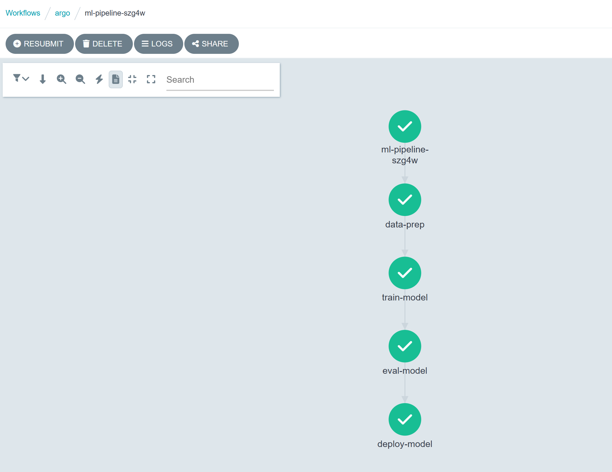

# Task Submission Template

## Task: `Day 1 - MLOps: Argo Workflows (Train Pipeline)`

- **Intern**: `Nguyễn Quang Dũng`
- **Phase / Week / Day**: `Phase 2 / Week 7 / Day 1`
- **Branch**: `phase-2/week-7`
- **Submitted at**: `2026-07-29`
- **Time spent**: `4h`

## 1. Mục tiêu
Thiết lập và vận hành Argo Workflows trên Kubernetes để điều phối Pipeline huấn luyện Machine Learning tự động. Xây dựng DAG bao gồm các step tuần tự và song song: Data Prep → Train → Eval → Deploy.

## 2. Cách chạy

**Bước 1: Khởi tạo Cluster và Cài đặt Argo Workflows**
Khởi tạo một Cluster bằng k3d và triển khai Argo Workflows vào Namespace `argo`.
```bash
k3d cluster create argo-cluster
kubectl create namespace argo
kubectl apply -n argo -f https://github.com/argoproj/argo-workflows/releases/download/v3.5.7/install.yaml
```
Cập nhật cơ chế xác thực cho Server để truy cập UI, đồng thời cấp quyền RoleBinding cho ServiceAccount mặc định để Workflow có quyền khởi tạo Pod:
```bash
kubectl patch deployment argo-server -n argo --type='json' -p='[{"op": "replace", "path": "/spec/template/spec/containers/0/args", "value": ["server", "--auth-mode=server"]}]'
kubectl create rolebinding default-admin --clusterrole=admin --serviceaccount=argo:default -n argo
```

**Bước 2: Truy cập Argo Server UI**

Mở Port-forward để truy cập giao diện quản lý:
```bash
kubectl port-forward deployment/argo-server -n argo 2746:2746
```
Truy cập UI trên trình duyệt tại địa chỉ: [https://localhost:2746](https://localhost:2746/)

**Bước 3: Xây dựng ML Pipeline Workflow**
Tạo file [ml-pipeline.yaml](ml-pipeline.yaml) định nghĩa DAG với 4 step mô phỏng quy trình MLOps:
```yaml
apiVersion: argoproj.io/v1alpha1
kind: Workflow
metadata:
  generateName: ml-pipeline-
  namespace: argo
spec:
  entrypoint: ml-dag
  templates:
  - name: ml-dag
    dag:
      tasks:
      - name: data-prep
        template: echo-task
        arguments:
          parameters: [{name: message, value: "Data preparation completed"}]
      - name: train-model
        dependencies: [data-prep]
        template: echo-task
        arguments:
          parameters: [{name: message, value: "Model training finished"}]
      - name: eval-model
        dependencies: [train-model]
        template: echo-task
        arguments:
          parameters: [{name: message, value: "Model evaluation passed with 95% accuracy"}]
      - name: deploy-model
        dependencies: [eval-model]
        template: echo-task
        arguments:
          parameters: [{name: message, value: "Model successfully deployed to production"}]

  - name: echo-task
    inputs:
      parameters:
      - name: message
    container:
      image: alpine:latest
      command: [sh, -c]
      args: ["echo '{{inputs.parameters.message}}'; sleep 5"]
```
(Workflow trên sử dụng Image Alpine và lệnh `echo` để mô phỏng cấu trúc DAG. Trong môi trường MLOps thực tế, Workflow sẽ phức tạp hơn:
- **Data Prep**: Khởi chạy Container chứa các thư viện xử lý dữ liệu (như Pandas, PySpark) để tải dữ liệu thô từ S3/MinIO, tiền xử lý và đẩy dữ liệu sạch sang step tiếp theo dưới dạng Artifact.
- **Train**: Sử dụng Container chứa các Framework (PyTorch, TensorFlow, Scikit-Learn) để huấn luyện mô hình, đồng thời log Parameters và Metrics lên hệ thống MLflow.
- **Eval**: Tải Model Artifact vừa huấn luyện để đánh giá trên tập Test, tự động đánh Fail (ngắt Pipeline) nếu độ chính xác không đạt ngưỡng.
- **Deploy**: Tương tác với API của KServe hoặc ArgoCD để tự động đưa mô hình lên môi trường Production.
Các step này sẽ trao đổi file và mô hình với nhau thông qua cơ chế Input/Output Artifacts của Argo Workflows kết hợp với Cloud Storage, thay vì chỉ truyền chuỗi văn bản qua Parameters).

**Bước 4: Thực thi và theo dõi Workflow**
Triển khai Workflow lên Cluster:
```bash
kubectl create -f ml-pipeline.yaml -n argo
```
Kiểm tra trạng thái qua Terminal:
```bash
kubectl get workflows -n argo
kubectl get pods -n argo
```
Sau đó, để quan sát trực quan luồng DAG trên giao diện web Argo UI:
1. Truy cập `https://localhost:2746/workflows/argo` (đảm bảo đã chọn Namespace `argo` ở thanh công cụ).
2. Click vào tên Workflow vừa tạo để xem biểu đồ các step chạy tuần tự và song song.


**Bước 5: Dọn dẹp tài nguyên**
Xóa toàn bộ Cluster sau khi hoàn tất kiểm tra:
```bash
k3d cluster delete argo-cluster
```

## 3. Kết quả

## 4. Self-check
- [x] Code chạy được trên máy sạch.
- [x] README có hướng dẫn run lại.
- [x] Không hard-code secret.
- [x] Review lại code 1 lượt.
