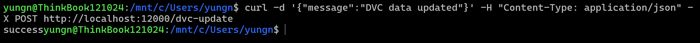
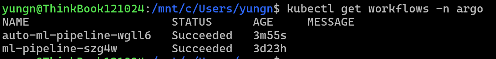

# Task Submission Template

## Task: `Day 2 - MLOps: Event Trigger`

- **Intern**: `Nguyễn Quang Dũng`
- **Phase / Week / Day**: `Phase 2 / Week 7 / Day 2`
- **Branch**: `phase-2/week-7`
- **Submitted at**: `2026-07-30 17:00`
- **Time spent**: `5h`

## 1. Mục tiêu

Thiết lập Argo Events trên Kubernetes để tự động hóa việc kích hoạt Workflow. Xây dựng một luồng sự kiện hoàn chỉnh bao gồm EventBus, Webhook EventSource và Sensor để tự động khởi tạo Argo Workflow khi nhận được tín hiệu (giả lập sự kiện thay đổi dữ liệu từ DVC).

## 2. Các bước thực hiện

**Bước 1: Cài đặt Argo Events và EventBus**

Khởi tạo Namespace `argo-events` và triển khai các thành phần hệ thống của Argo Events:
```bash
kubectl create namespace argo-events
kubectl apply -n argo-events -f https://raw.githubusercontent.com/argoproj/argo-events/stable/manifests/install.yaml
kubectl apply -n argo-events -f https://raw.githubusercontent.com/argoproj/argo-events/stable/manifests/install-validating-webhook.yaml
```
Khởi tạo EventBus (sử dụng NATS làm Message Broker mặc định) để làm cầu nối giữa EventSource và Sensor:
```bash
kubectl apply -n argo-events -f https://raw.githubusercontent.com/argoproj/argo-events/stable/examples/eventbus/native.yaml
```

**Bước 2: Cấu hình Webhook EventSource**

Tạo file [`webhook-source.yaml`](webhook-source.yaml) định nghĩa một EventSource lắng nghe HTTP POST request tại Port 12000, giả lập tín hiệu gửi về từ kho lưu trữ dữ liệu (DVC/Git):
```yaml
apiVersion: argoproj.io/v1alpha1
kind: EventSource
metadata:
  name: webhook
  namespace: argo-events
spec:
  service:
    ports:
      - port: 12000
        targetPort: 12000
  webhook:
    example:
      port: "12000"
      endpoint: /dvc-update
      method: POST
```
Triển khai EventSource lên Cluster:
```bash
kubectl apply -f webhook-source.yaml
```

**Bước 3: Xây dựng Sensor để Trigger Workflow**

Tạo file [`webhook-sensor.yaml`](webhook-sensor.yaml) định nghĩa Sensor. Sensor này sẽ bắt sự kiện từ Webhook trên và tự động submit một Workflow mới (tái sử dụng cấu trúc DAG ở Day 1):
```yaml
apiVersion: argoproj.io/v1alpha1
kind: Sensor
metadata:
  name: webhook
  namespace: argo-events
spec:
  template:
    serviceAccountName: default
  dependencies:
    - name: test-dep
      eventSourceName: webhook
      eventName: example
  triggers:
    - template:
        name: webhook-workflow-trigger
        k8s:
          operation: create
          source:
            resource:
              apiVersion: argoproj.io/v1alpha1
              kind: Workflow
              metadata:
                generateName: auto-ml-pipeline-
                namespace: argo
              spec:
                entrypoint: ml-dag
                templates:
                - name: ml-dag
                  dag:
                    tasks:
                    - name: train-model
                      template: echo-task
                - name: echo-task
                  container:
                    image: alpine:latest
                    command: [sh, -c]
                    args: ["echo 'Model training triggered by DVC event!'; sleep 5"]
```

- Để Sensor ở Namespace `argo-events` có quyền tạo Workflow ở Namespace `argo`, cần cấu hình RBAC RoleBinding cho ServiceAccount `default`.

Cấp quyền và triển khai Sensor:
```bash
kubectl create rolebinding argo-events-creator --clusterrole=admin --serviceaccount=argo-events:default -n argo
kubectl apply -f webhook-sensor.yaml
```

**Bước 4: Kích hoạt Pipeline tự động (Testing)**

Mở Port-forward cho Webhook EventSource ra Localhost:
```bash
kubectl port-forward service/webhook-eventsource-svc -n argo-events 12000:12000 &
```
Gửi một request giả lập sự kiện có thay đổi dữ liệu từ DVC:
```bash
curl -d '{"message":"DVC data updated"}' -H "Content-Type: application/json" -X POST http://localhost:12000/dvc-update
```

Kiểm tra xem Sensor đã tự động sinh ra Workflow mới bên Namespace `argo` hay chưa:
```bash
kubectl get workflows -n argo
```


**Bước 5: Dọn dẹp tài nguyên**

```bash
kubectl delete -f webhook-sensor.yaml
kubectl delete -f webhook-source.yaml
```

## 3. Kết quả

## 4. Self-check
- [x] Code chạy được trên máy sạch.
- [x] README có hướng dẫn run lại.
- [x] Không hard-code secret.
- [x] Review lại code 1 lượt.
