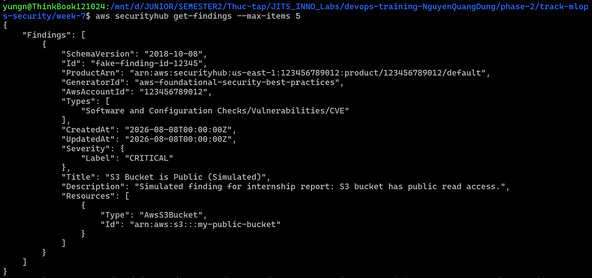

# Task Submission Template

## Task: `Day 3 - Security: Cloud Security (AWS)`

- **Intern**: `Nguyễn Quang Dũng`
- **Phase / Week / Day**: `Phase 2 / Week 7 / Day 3`
- **Branch**: `phase-2/week-7`
- **Submitted at**: `2026-07-31`
- **Time spent**: `4h`

## 1. Mục tiêu
Thiết lập Baseline bảo mật cơ bản cho tài khoản AWS bằng cách kích hoạt và cấu hình các dịch vụ giám sát trọng tâm: Amazon GuardDuty, AWS Security Hub và IAM Access Analyzer. Thu thập các Findings về một bảng điều khiển duy nhất để phân tích.

## 2. Các bước thực hiện

*Lưu ý: Do tài khoản AWS hiện tại không đủ thẩm quyền, quá trình thực hành dưới đây sử dụng thư viện Moto để dựng một AWS Mock Server ở môi trường Local, kết hợp với biến môi trường của AWS CLI để điều hướng API.*

**Bước 1: Thiết lập môi trường Mock Server**

Cài đặt và khởi chạy Moto Server trên Local ở Port 5001 (treo ở một tab Terminal riêng):
```bash
pip install "moto[server]"
moto_server -p 5001
```
Ở Terminal thực thi lệnh chính, thiết lập biến môi trường để ép toàn bộ lệnh AWS CLI gọi vào Mock Server thay vì gọi lên AWS thật:
```bash
export AWS_ENDPOINT_URL=http://localhost:5001
```

**Bước 2: Kích hoạt Amazon GuardDuty**

Khởi tạo một Detector mới để GuardDuty bắt đầu tự động thu thập và phân tích CloudTrail, VPC Flow Logs và DNS Logs:
```bash
aws guardduty create-detector --enable
```
Lưu lại ID trả về từ lệnh trên (định dạng JSON từ Mock Server) để sử dụng cho các cấu hình nâng cao nếu cần.

**Bước 3: Kích hoạt AWS Security Hub**

Bật dịch vụ Security Hub để tổng hợp các cảnh báo bảo mật từ GuardDuty và tự động đánh giá cấu hình:
```bash
aws securityhub enable-security-hub --enable-default-standards
```
Lệnh trên đồng thời kích hoạt 2 bộ tiêu chuẩn bảo mật mặc định là AWS Foundational Security Best Practices và CIS AWS Foundations Benchmark.

**Bước 4: Cấu hình IAM Access Analyzer**

Tạo một Analyzer ở phạm vi tài khoản để liên tục kiểm tra các Policy xem có tài nguyên nào bị rò rỉ quyền truy cập ra bên ngoài hay không:
```bash
aws accessanalyzer create-analyzer \
    --analyzer-name devsecops-account-analyzer \
    --type ACCOUNT
```

**Bước 5: Giả lập và kiểm tra Findings**

Do môi trường Mock Server không tự động quét lỗi, ta tiến hành tạo file [`fake-finding.json`](fake-finding.json) để giả lập một vụ lộ lọt dữ liệu S3 Bucket public:
```json
[
  {
    "SchemaVersion": "2018-10-08",
    "Id": "fake-finding-id-12345",
    "ProductArn": "arn:aws:securityhub:us-east-1:123456789012:product/123456789012/default",
    "GeneratorId": "aws-foundational-security-best-practices",
    "AwsAccountId": "123456789012",
    "Types": ["Software and Configuration Checks/Vulnerabilities/CVE"],
    "CreatedAt": "2026-08-08T00:00:00Z",
    "UpdatedAt": "2026-08-08T00:00:00Z",
    "Severity": {"Label": "CRITICAL"},
    "Title": "S3 Bucket is Public (Simulated)",
    "Description": "Simulated finding for internship report: S3 bucket has public read access.",
    "Resources": [{
      "Type": "AwsS3Bucket",
      "Id": "arn:aws:s3:::my-public-bucket"
    }]
  }
]
```
Bơm cảnh báo giả lập này vào Security Hub:
```bash
aws securityhub batch-import-findings --findings file://fake-finding.json
```
Kiểm tra các Findings đổ về hệ thống (đã được chuẩn hóa theo định dạng ASFF tại Security Hub):
```bash
aws securityhub get-findings --max-items 5
```


## 3. Kết quả

## 4. Self-check
- [x] Code chạy được trên máy sạch.
- [x] README có hướng dẫn run lại.
- [x] Không hard-code secret.
- [x] Review lại code 1 lượt.
