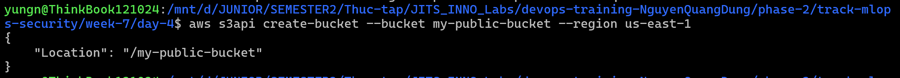
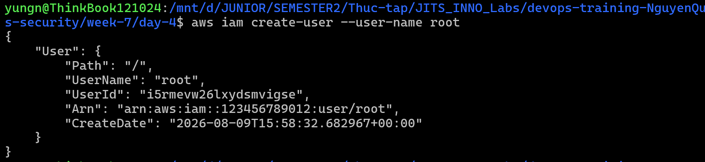
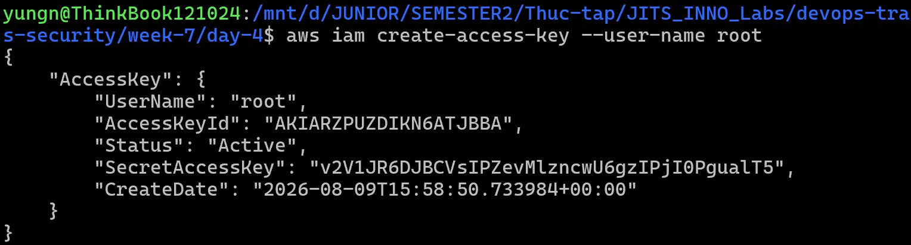
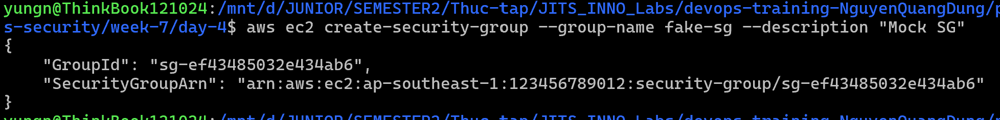
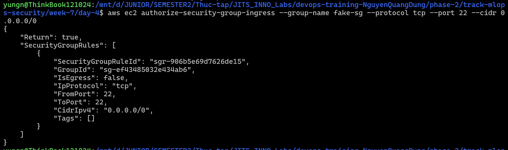
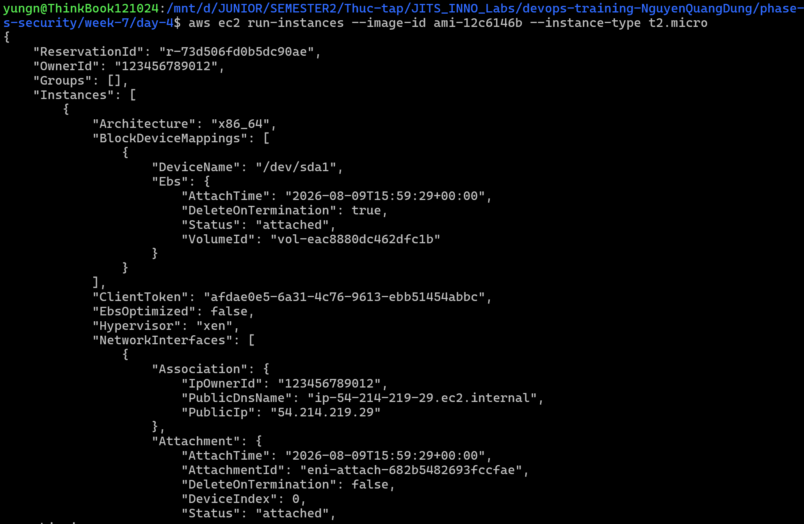
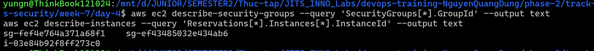
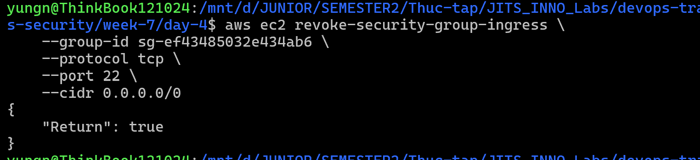
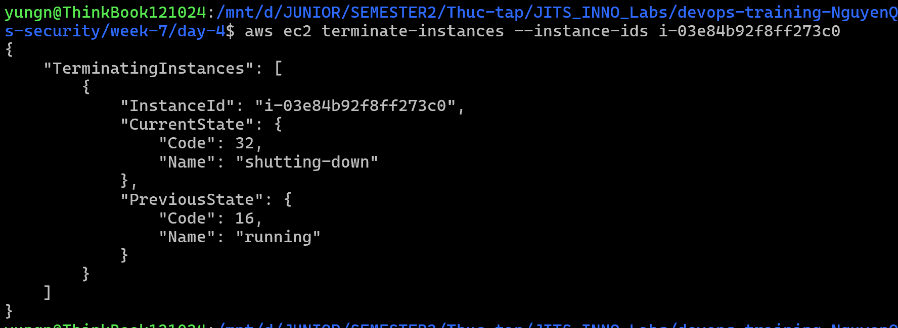
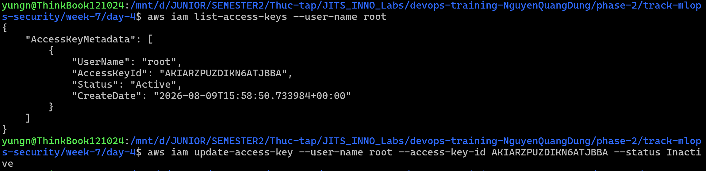

# Task Submission Template

## Task: `Day 4 - Security: Triage Findings`

- **Intern**: `Nguyễn Quang Dũng`
- **Phase / Week / Day**: `Phase 2 / Week 7 / Day 4`
- **Branch**: `phase-2/week-7`
- **Submitted at**: `2026-08-01 17:45`
- **Time spent**: `5h`

## 1. Mục tiêu
Thực hành quy trình Triage dựa trên chuẩn ASFF của AWS. Phân tích 5 cảnh báo mẫu từ Security Hub và GuardDuty, từ đó xây dựng Action Plan đi kèm với câu lệnh khắc phục trực tiếp cho từng lỗ hổng bảo mật. Kịch bản được thực thi hoàn toàn trên môi trường AWS Mock Server.

## 2. Quá trình phân tích và Triage

**Bước 1: Thiết lập môi trường AWS Mock Server**

Tương tự như Day 3, tiến hành khởi chạy Moto Server và điều hướng AWS CLI để tạo môi trường thực hành khép kín:
```bash
moto_server -p 5001
export AWS_ENDPOINT_URL=http://localhost:5001
```

Khởi tạo các tài nguyên giả lập trên Moto Server để phục vụ cho kịch bản Triage:

Tạo S3 Bucket:
```bash
aws s3api create-bucket --bucket my-public-bucket --region us-east-1
```


Tạo IAM User tên root:
```bash
aws iam create-user --user-name root
```


Tạo Access Key cho tài khoản root:
```bash
aws iam create-access-key --user-name root
```


Tạo Security Group và mở Port 22:
```bash
aws ec2 create-security-group --group-name fake-sg --description "Mock SG"
aws ec2 authorize-security-group-ingress --group-name fake-sg --protocol tcp --port 22 --cidr 0.0.0.0/0
```




Khởi chạy EC2 Instance:
```bash
aws ec2 run-instances --image-id ami-12c6146b --instance-type t2.micro
```


Tiến hành truy vấn tự động để trích xuất nhanh `GroupId` và `InstanceId` vừa tạo nhằm phục vụ cho các lệnh xử lý lỗi bên dưới:
```bash
aws ec2 describe-security-groups --query 'SecurityGroups[*].GroupId' --output text
aws ec2 describe-instances --query 'Reservations[*].Instances[*].InstanceId' --output text
```

- `GroupId`: sg-ef43485032e434ab6
- `InstanceId`: i-03e84b92f8ff273c0

**Bước 2: Phân tích và Triage lỗ hổng S3 Bucket**

Tiến hành kiểm tra dữ liệu JSON thô của cảnh báo:
```json
{
  "Id": "arn:aws:securityhub:us-east-1:123456789012:finding/s3-public",
  "Title": "S3 Bucket is Public",
  "Severity": { "Label": "CRITICAL" },
  "Resources": [
    {
      "Type": "AwsS3Bucket",
      "Id": "arn:aws:s3:::my-public-bucket"
    }
  ]
}
```
- **Quá trình phân tích**: Đọc cấu trúc JSON của cảnh báo, nhận diện trường `Title` là "S3 Bucket is Public". Tiến hành kiểm tra trường `Resources` để trích xuất tên của Bucket bị cấu hình sai.
- **Severity**: CRITICAL.
- **Nhận định**: Đây là cấu hình sai tài nguyên lưu trữ, tiềm ẩn nguy cơ cực kỳ cao rò rỉ dữ liệu nhạy cảm ra ngoài Internet.
- **Action Plan**: Thực thi lệnh AWS CLI vào Mock Server để lập tức cấu hình Block Public Access cho Bucket `my-public-bucket` vừa tạo:
```bash
aws s3api put-public-access-block \
    --bucket my-public-bucket \
    --public-access-block-configuration "BlockPublicAcls=true,IgnorePublicAcls=true,BlockPublicPolicy=true,RestrictPublicBuckets=true"
```

**Bước 3: Phân tích và Triage lỗ hổng IAM User Password**

Tiến hành kiểm tra dữ liệu JSON thô của cảnh báo:
```json
{
  "Id": "arn:aws:securityhub:us-east-1:123456789012:finding/iam-password",
  "Title": "IAM User password policy does not require minimum length",
  "Severity": { "Label": "MEDIUM" },
  "Compliance": { "Status": "FAILED" },
  "Resources": [
    {
      "Type": "AwsAccount",
      "Id": "AWS::::Account:123456789012"
    }
  ]
}
```
- **Quá trình phân tích**: Tiếp nhận cảnh báo có `Title` là "IAM User password policy does not require minimum length". Kiểm tra trường `Compliance` xác định hệ thống đang vi phạm chuẩn CIS AWS Foundations Benchmark.
- **Severity**: MEDIUM.
- **Nhận định**: Đây là lỗ hổng quản lý định danh. Mật khẩu yếu tạo điều kiện cho các cuộc tấn công Brute-force từ bên ngoài.
- **Action Plan**: Tiến hành chạy lệnh cấu hình lại Password Policy cho tài khoản, bắt buộc mật khẩu phải dài tối thiểu 14 ký tự và có ký tự đặc biệt:
```bash
aws iam update-account-password-policy \
    --minimum-password-length 14 \
    --require-symbols \
    --require-numbers \
    --require-uppercase-characters \
    --require-lowercase-characters
```

**Bước 4: Phân tích và Triage lỗ hổng EC2 Security Group**

Tiến hành kiểm tra dữ liệu JSON thô của cảnh báo:
```json
{
  "Id": "arn:aws:securityhub:us-east-1:123456789012:finding/ec2-ssh",
  "Title": "EC2 Instance has port 22 open to 0.0.0.0/0",
  "Severity": { "Label": "HIGH" },
  "Resources": [
    {
      "Type": "AwsEc2SecurityGroup",
      "Id": "arn:aws:ec2:us-east-1:123456789012:security-group/sg-0123456789abcdef0"
    }
  ]
}
```
- **Quá trình phân tích**: Đọc cảnh báo "EC2 Instance has port 22 open to 0.0.0.0/0". Phân tích trường `Resources` để trích xuất mã ID của Security Group.
- **Severity**: HIGH.
- **Nhận định**: Lỗ hổng mạng này tạo bề mặt tấn công trực tiếp vào máy chủ từ xa, hacker có thể dò quét và brute-force SSH liên tục.
- **Action Plan**: Dùng lệnh AWS CLI xóa bỏ Inbound Rule cho phép Port 22 từ nguồn `0.0.0.0/0` khỏi Security Group tương ứng (cờ `--group-id` là ID của Mock SG đã tạo ở Bước 1):
```bash
aws ec2 revoke-security-group-ingress \
    --group-id sg-ef43485032e434ab6 \
    --protocol tcp \
    --port 22 \
    --cidr 0.0.0.0/0
```


**Bước 5: Phân tích và Triage sự cố GuardDuty Malware**

Tiến hành kiểm tra dữ liệu JSON thô của cảnh báo:
```json
{
  "Id": "arn:aws:guardduty:us-east-1:123456789012:detector/123/finding/abc",
  "Title": "Cryptocurrency mining on EC2",
  "Severity": { "Label": "CRITICAL" },
  "Action": {
    "ActionType": "NETWORK_CONNECTION",
    "NetworkConnectionAction": {
      "RemoteIpDetails": { "IpAddressV4": "198.51.100.2" }
    }
  },
  "Resources": [
    {
      "Type": "AwsEc2Instance",
      "Id": "i-03e84b92f8ff273c0"
    }
  ]
}
```
- **Quá trình phân tích**: Nhận được cảnh báo khẩn cấp từ GuardDuty. Kiểm tra trường `Action` để xác định IP độc hại (198.51.100.2) và trường `Resources` để lấy mã Instance ID.
- **Severity**: CRITICAL.
- **Nhận định**: Đây là sự cố bảo mật nghiêm trọng (True Positive). Máy chủ đã bị xâm nhập và chiếm quyền điều khiển để chạy tiến trình đào tiền ảo.
- **Action Plan**: Tiến hành Terminate (tiêu hủy) ngay lập tức EC2 Instance bị nhiễm Malware để chặn đứng kết nối mạng độc hại (cờ `--instance-ids` là ID của Mock Instance đã tạo ở Bước 1):
```bash
aws ec2 terminate-instances --instance-ids i-03e84b92f8ff273c0
```


**Bước 6: Phân tích và Triage sự cố truy cập Root**

Tiến hành kiểm tra dữ liệu JSON thô của cảnh báo:
```json
{
  "Id": "arn:aws:securityhub:us-east-1:123456789012:finding/root-usage",
  "Title": "Root account used recently",
  "Severity": { "Label": "HIGH" },
  "Resources": [
    {
      "Type": "AwsAccount",
      "Id": "AWS::::Account:123456789012"
    }
  ]
}
```
- **Quá trình phân tích**: Tiếp nhận sự kiện "Root account used recently". Kiểm tra AWS CloudTrail Log để xác minh danh sách các API mà tài khoản Root vừa gọi.
- **Severity**: HIGH.
- **Nhận định**: Vi phạm nguyên tắc Least Privilege. Tài khoản Root có quyền lực tuyệt đối, không được phép dùng cho tác vụ hàng ngày vì nếu lộ lọt sẽ mất toàn bộ tài nguyên.
- **Action Plan**: Truy xuất IAM để rà soát và vô hiệu hóa ngay lập tức mọi Access Key đang tồn tại của Root, buộc quản trị viên phải dùng Console kèm MFA cứng:
```bash
aws iam list-access-keys --user-name root # Lấy trường AccessKeyId thay vào <ACCESS_KEY_ID> của lệnh tiếp theo
aws iam update-access-key --user-name root --access-key-id <ACCESS_KEY_ID> --status Inactive
```


## 3. Kết quả

## 4. Self-check
- [x] Code chạy được trên máy sạch.
- [x] README có hướng dẫn run lại.
- [x] Không hard-code secret.
- [x] Review lại code 1 lượt.
