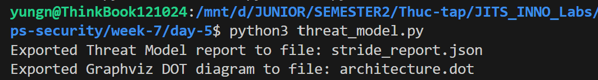

# Task Submission Template

## Task: `Day 5 - Security: Threat Modeling`

- **Intern**: `Nguyễn Quang Dũng`
- **Phase / Week / Day**: `Phase 2 / Week 7 / Day 5`
- **Branch**: `phase-2/week-7/day-5`
- **Submitted at**: `2026-08-02 21:00` (timezone +07)
- **Time spent**: `4h`

## 1. Mục tiêu
Thực hành nhận diện rủi ro bảo mật qua mô hình STRIDE bằng công cụ Threat Modeling as Code (`threat_model.py`). Phân tích chi tiết và xuất báo cáo Threat Model tự động cho hệ thống Web App triển khai trên nền tảng Google Cloud. Thực thi kịch bản kiểm tra và xây dựng Action Plan bằng các câu lệnh `gcloud` tương ứng.

## 2. Cách chạy

**Bước 1: Thực thi script Threat Modeling as Code**

Khởi chạy script `threat_model.py` để tự động hóa quá trình phân tích rủi ro STRIDE và khởi tạo sơ đồ kiến trúc:
```bash
python3 threat_model.py
```


Kết quả thực thi xuất ra 2 file báo cáo:
- [`stride_report.json`](./stride_report.json): Chứa danh sách phân loại chi tiết 6 hạng mục rủi ro STRIDE kèm theo Severity và Action Plan.
- [`architecture.dot`](./architecture.dot): Sơ đồ luồng dữ liệu (Data Flow) dạng Graphviz.


**Bước 2: Phân tích và xử lý rủi ro Spoofing (Giả mạo)**

Tiến hành kiểm tra luồng dữ liệu xác thực từ Client đến hệ thống:
- **Quá trình phân tích**: Kẻ tấn công có thể đánh cắp Cookie hoặc mạo danh người dùng hợp lệ để gửi request.
- **Severity**: HIGH.
- **Action Plan**: Triển khai Identity-Aware Proxy (IAP) của Google Cloud để xác thực người dùng tập trung:
```bash
# Bật tính năng IAP cho backend service của Cloud Load Balancing
gcloud compute backend-services update web-backend-service \
    --global \
    --iap=enabled
```

**Bước 3: Phân tích và xử lý rủi ro Tampering (Chỉnh sửa dữ liệu)**

Tiến hành kiểm tra đường truyền và luồng xử lý truy vấn:
- **Quá trình phân tích**: Dữ liệu có thể bị thay đổi trên đường truyền nếu không mã hóa, hoặc kẻ gian truyền tham số độc hại (SQL Injection) vào hệ thống.
- **Severity**: CRITICAL.
- **Action Plan**: Ép buộc sử dụng HTTPS với chứng chỉ SSL/TLS và bật Cloud Armor lọc payload SQLi/XSS:
```bash
# Tạo chính sách bảo mật Cloud Armor chống SQL Injection
gcloud compute security-policies create block-sqli-policy \
    --description "Block SQL Injection Attacks"

# Bổ sung rule chặn SQLi dựa trên OWASP ModSecurity Core Rule Set
gcloud compute security-policies rules create 1000 \
    --security-policy block-sqli-policy \
    --expression "evaluatePreconfiguredExpr('sqli-v33-stable')" \
    --action "deny-403"
```

**Bước 4: Phân tích và xử lý rủi ro Repudiation (Phủ nhận)**

Tiến hành rà soát cơ chế Audit Log của hệ thống:
- **Quá trình phân tích**: Người dùng hoặc quản trị viên thực hiện thao tác thay đổi dữ liệu quan trọng nhưng chối bỏ, trong khi hệ thống thiếu log ghi nhận cụ thể.
- **Severity**: MEDIUM.
- **Action Plan**: Bật Cloud Audit Logs và kiểm tra trạng thái lưu vết:
```bash
# Kiểm tra danh sách các dịch vụ đang được theo dõi Audit Log
gcloud logging logs list --filter="logName:cloudaudit.googleapis.com"
```

**Bước 5: Phân tích và xử lý rủi ro Information Disclosure (Lộ thông tin)**

Tiến hành rà soát file cấu hình và cơ chế phân quyền:
- **Quá trình phân tích**: Mật khẩu kết nối Cloud SQL được ghi cứng (hard-code) trong file biến môi trường trên Compute Engine.
- **Severity**: HIGH.
- **Action Plan**: Lưu trữ mật khẩu vào Google Cloud Secret Manager và cấp quyền đọc hạn chế cho Service Account:
```bash
# Tạo secret lưu credentials của Database
gcloud secrets create db-credentials --replication-policy="automatic"

# Thêm phiên bản mật khẩu mới vào Secret Manager
echo -n "super-secret-db-password" | gcloud secrets versions add db-credentials --data-file=-
```

**Bước 6: Phân tích và xử lý rủi ro Denial of Service (Từ chối dịch vụ)**

Tiến hành phân tích khả năng chịu tải của hệ thống:
- **Quá trình phân tích**: Kẻ tấn công gửi lượng lớn request giả mạo mỗi giây khiến Compute Engine cạn kiệt tài nguyên CPU/RAM.
- **Severity**: HIGH.
- **Action Plan**: Cấu hình Cloud Armor Rate Limiting để giới hạn request từ mỗi IP:
```bash
# Thêm rule giới hạn tần suất request tối đa 100 request / phút từ 1 IP
gcloud compute security-policies rules create 2000 \
    --security-policy block-sqli-policy \
    --expression "true" \
    --action "rate-based-ban" \
    --rate-limit-threshold-count 100 \
    --rate-limit-threshold-interval-sec 60 \
    --ban-duration-sec 300 \
    --conform-action "allow"
```

**Bước 7: Phân tích và xử lý rủi ro Elevation of Privilege (Leo thang đặc quyền)**

Tiến hành kiểm tra phân quyền truy cập tại cấp độ Cloud:
- **Quá trình phân tích**: Một Developer bình thường vô tình có quyền xóa Database do được cấp quyền `Editor` nguyên dự án thay vì quyền cụ thể.
- **Severity**: CRITICAL.
- **Action Plan**: Thu hồi quyền hạn thừa và áp dụng Custom Role mang nguyên tắc Least Privilege:
```bash
# Liệt kê các role đang được gắn vào tài khoản Service Account
gcloud projects get-iam-policy my-gcp-project \
    --flatten="bindings[].members" \
    --format="table(bindings.role, bindings.members)" \
    --filter="bindings.members:my-app-sa*"
```

## 3. Kết quả

## 4. Khó khăn & cách giải quyết

## 5. Reference
- [OWASP Threat Modeling](https://owasp.org/www-community/Threat_Modeling)
- [Google Cloud Security Best Practices](https://cloud.google.com/security/best-practices)

## 6. Self-check
- [x] Code chạy được trên máy sạch.
- [x] README có hướng dẫn run lại.
- [x] Không hard-code secret.
- [x] Commit message theo Conventional Commits.
- [x] Đã review lại code 1 lượt.
